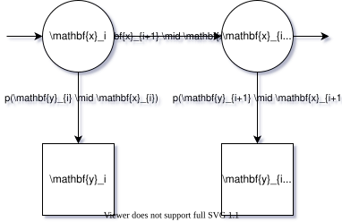

I present (JAXNLDS) a JAX-based package that enables solving non-linear dynamical problems.
I then apply JAXNLDS to 

## Story

    
Time-series modelling is one of the most important type of problem.
From predicting the progression of the climate crisis and the price of stocks, to guiding rockets and reinforcement learning, time-series modelling underlies it all.

 If we want to treat time-series in a rigourous manner, then we might choose a Bayesian treatement.
In this case, we typically choose to make the Markov assumption about a state and observable, as captured in the figure.
The arrows, in this case, refer to conditional dependence.
They say that the state, \(\mathbf{x}_{i+1}\), is _only_ conditionally dependent on the preceeding state, \(\mathbf{x}_{i}\), and that the observable, \(\mathbf{y}_{i}\), is only conditionally dependent on the current state, \(\mathbf{x}_{i}\).
This is encapsulated in this Markovian decomposition,
\[
p(\mathbf{x}_{0:T}, \mathbf{y}_{0:T}) = p(\mathbf{x}_{0})\prod_{i=1}^T p(\mathbf{y}_{i}\mid\mathbf{x}_{i}) p(\mathbf{x}_{i}\mid\mathbf{x}_{i-1})
\]
 
The first thing that's important to say is that the notion of arrow direction shouldn't be confused with causality.
This point is made clear in [Judea Pearl's Causality (2009)](https://en.wikipedia.org/wiki/Causality_(book)).
Arrows just mean conditional dependence, and nothing more.
In fact, what you may, or may not, find surprising is that you can reverse the direction of all the arrows in any Markovian decomposition of any probability distribution, and the resulting decompositions would be equivalent though they would look different.
We simply used our asthetics to choose this direction of arrows.
Let us not distract from the main point.

Once you assume this particular structure, as presented in the diagram, what follows are a sequence of simplifications.
I discuss these simplifications near the end of [this talk](/research/rci-talk/) and they can be boiled down to a forward equation, and a backward equation.

The forward equation represents the posterior probability of the current state given all past data,
\[
p(\mathbf{x}_{i}\mid\mathbf{y}_{0:i})= \frac{p(\mathbf{y}_i\mid\mathbf{x}_{i})\mathbb{E}_{\mathbf{x}_{i-1}\mid\mathbf{y}_{0:i-1}}\left[p(\mathbf{x}_{i}\mid\mathbf{x}_{i-1})\right]}{p(\mathbf{y}_{i}\mid\mathbf{y}_{0:i-1})}
\]

and the backward equation gives us the posterior probability of the state at a given point given all data including future data,
\[
p(\mathbf{x}_{i}\mid\mathbf{y}_{0:T})=p(\mathbf{x}_{i}\mid\mathbf{y}_{0:i}) \int \frac{p(\mathbf{x}_{i+1}\mid\mathbf{x}_{i})}{p(\mathbf{x}_{i+1}\mid\mathbf{y}_{0:i})}p(\mathbf{x}_{i+1}\mid\mathbf{y}_{0:T})\mathrm{d}\mathbf{x}_{i+1}
\].

The two main components are: a transfer distribution \(p(\mathbf{x}_{i+1}\mid\mathbf{x}_{i})\), and a likelihood \(p(\mathbf{y}_{i}\mid\mathbf{x}_{i})\).
When these are both Gaussian the forward and backward equations correspond to the Kalman (1960) and Rauch (1963) equations.

## Example
